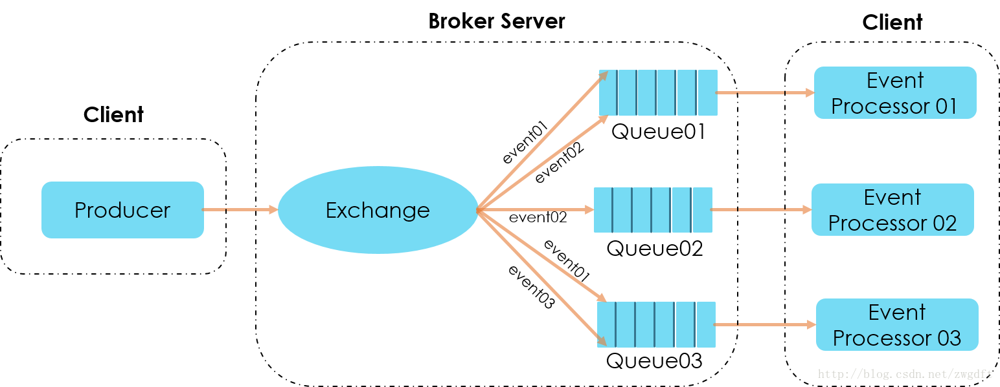

### libEvent

libEvent 是一种事件驱动机制，底层核心是Reactor框架。

* #### 原理

  将多种类型的事件绑定到Reactor(反射器)实例当中，并设定好关注的事件类型，当关注的类型发生后，则调用对应的接口函数进行处理。

* #### 关系

  当注册事件发送特定的消息后，将其添加到订阅者链表里面，然后发布者将消息分发到订阅者链表中的所有节点。

* #### 实用性

  > 实现难度： 2
  >
  > 稳定性:  2 (老版本没有锁)
  >
  > 性能:   4 (基于多路复用，就是发布可能比较麻烦。
  >
  > 代码量:  少

----

### rabbitMq

rabbitMq是一种生产者--消费者模式,支持发布/订阅模式

* #### 原理

  使用event name/id来作为RabbitMQ的routing key的名字。Event Processor 01对event 01 和event 02感兴趣，则在启动Consumer Worker时，将自己的Queue绑定到这两个routing key上即可，其他Event Processor也是如此，这样便完成了事件的订阅。当有事件发布时，消息便会按照event name/id被投递到对应的Queue中。

  

* 实用性

  > 实现难度： 4
  >
  > 稳定性:  4
  >
  > 性能:  3 (基于多路复用，就是发布可能比较麻烦。
  >
  > 代码量:  多

---

### [mqtt](https://zhuanlan.zhihu.com/p/20888181)

MQTT是基于二进制消息的发布/订阅编程模式的消息协议,规范很简单，非常适合需要低功耗和网络带宽有限的IoT场景，比如

* 遥感数据
* 汽车
* 智能家居（适合我们使用）
* 智慧城市
* 医疗医护

由于物联网的环境是非常特别的，所以MQTT遵循以下设计原则：

* 精简，不添加可有可无的功能。

* 发布/订阅（Pub/Sub）模式，方便消息在传感器之间传递。

* 允许用户动态创建主题，零运维成本。

* 把传输量降到最低以提高传输效率。

* 把低带宽、高延迟、不稳定的网络等因素考虑在内。

* 支持连续的会话控制。

* 理解客户端计算能力可能很低。

* 提供服务质量管理。

* 假设数据不可知，不强求传输数据的类型与格式，保持灵活性。

