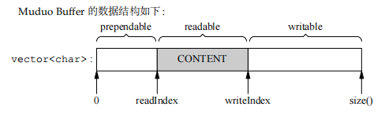

# buffer 

为了避免 socket 读、写进行堵塞， 可以分别设置 inputBuffer 、缓冲区,
并将 socket 注册到 epoll 中， 当 socket 变得可读，或者可写的时侯，再从缓冲区取数据写，或者是将读到的内容添加到缓冲区。

## 实现

buffer的数据结构




成员:
* writerIndex_: 写缓冲区开始的索引
* readerIndex_: 读缓冲区开始的索引

## 添加数据

首先判断 写缓冲区是否足够，若不足够，则进行下一步处理

```c++
void ensureWritableBytes(size_t len)
{
    if (writableBytes() < len)
    {
        makeSpace(len);
    }
    assert(writableBytes() >= len);
}
```

在 makeSpace 中， 判断写缓冲区加预留区域是否满足写的数据, 若不满足，则扩容，扩容成刚好能容纳写的数据
```c++
if (writableBytes() + prependableBytes() < len + kCheapPrepend)
{
    // FIXME: move readable data
    buffer_.resize(writerIndex_ + len);
}
```

若足够，则将读缓冲区移到最前面，然后重置读缓冲区和写缓冲区的指针位置
```c++
assert(kCheapPrepend < readerIndex_);
size_t readable = readableBytes();
std::copy(begin() + readerIndex_,
            begin() + writerIndex_,
            begin() + kCheapPrepend);
readerIndex_ = kCheapPrepend;
writerIndex_ = readerIndex_ + readable;
assert(readable == readableBytes());
```

## 读数据

若读的数据小于可读的大小，则右移 readerIndex_ 的位置
```c++
if (len < readableBytes())
{
    readerIndex_ += len;
}
```

否则将 writerIndex_ 和 readerIndex_ 重新归位。


## 注意

retrieve() 只操作索引，若要获取对应的数据，则通过 readerIndex_ 的位置再加上 len 来截取缓冲区。


## readFd

```c++
ssize_t Buffer::readFd(int fd, int* savedErrno);
```

若读的缓冲区大小不确定，可以将它放在我们申请的临时缓冲区，在通过 append 操作扩容。

即每次通过 readFd 读取最大的文件内容， 一部分放在 buffer, 一部分放在临时缓冲区内。