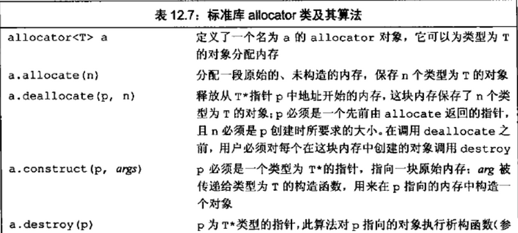

## allocator

allocator 是 分配和初始化分离， 而 new 则是将分配和初始化连在一起。

#### 定义：

在 memory.h 头文件中， 分配的内存是原始的、未构造的。

#### 应用：

当分配一大块内存时，我们通常需要在这块内存上按需构造对象，因此需要将分配和初始化分离，只有到真正需要时才执行对象的初始化操作。

#### 使用：

 **当我们用完对象后，必须对每个构造的元素调用destroy来销毁它们**。函数destroy接受一个指针，对执行的对象执行析构函数。**我们只能对真正构造了的元素进行destroy操作**。一旦元素被销毁后，就可以重新使用这部分内存来保存其它string，也可以将其归还给系统。

释放内存通过调用deallocate来完成