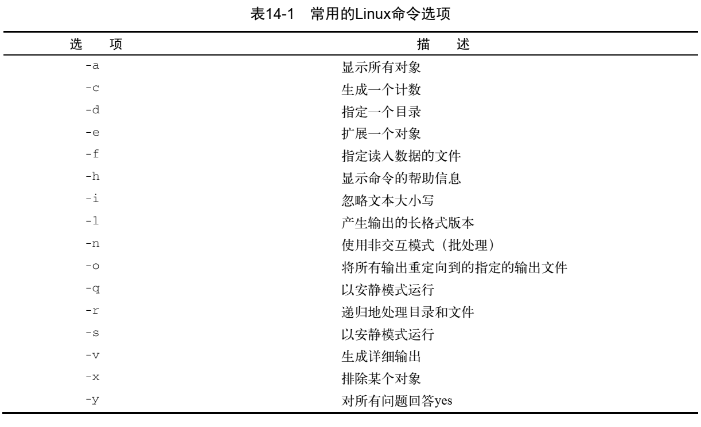

## shell 进阶

### 查找可执行文件

```
IFS=:
for folder in $PATH
do
	echo "$folder:"
	for file in $folder/*
	do
		if [ -x $file ]
		then
			echo " $file"
		fi
	done
done
```

### 处理命令行参数

$0 是程序名， $1 是第一个参数，$2 是第二个参数。

$# 是命令行参数的个数。

$* 是将所有的参数当做一个单词保存，$@ 是保存所有的参数放在一个列表中。

shift 是移动命令参数，即整体命令向右移, 且右移后的参数不可恢复。

```
shift n
```

分离参数 和 选项，使用 -- 特殊符号

使用 getopt 或 getopts 来处理命令行参数


### 命令选项标准



### 读取终端输入

- [ ] -p: 后面接提示字符串

```
read -p "Please enter your name: " age
```

read 后面可以跟多个变量进行接收，若变量数小于输入数据，则将剩下的数据保存到最后一个变量中。

若 read 后不接变量，则将输入内容保存到 $REPLY 宏变量中。

#### 超时

- [ ] -t  n : 指定超时时间，单位是秒。

若超时未有输入，则会返回一个非零退出状态码


- [ ] -nx: 接收x个字符。

- [ ] -s: 隐藏输入，比如输入密码。

#### 从文件中读取

```
count=1
cat test | while read line
do
	echo "Line $count: $line"
	count=$[ $count + 1]
done
```


### 标准文件描述符

- [ ] 0    stdin     标准输入
- [ ] 1   stdout   标准输出
- [ ] 2   stderr    标准错误


### 重定向

重定向文件描述符时， 需要在文件描述符数字前加一个 &。

#### 永久重定向

```
exec 1>testout
```


### 捕获信号

```
trap commands signals
```


### 创建函数

```
function name {
	commands
}
```

或

```
name() {
	commands
}
```

### return 指令

return 指令用来退出函数并返回状态码。

### 传参

#### 向函数传递参数

```
func param1
```

#### 向函数传递数组参数

```
myarray=(1 2 3 4 5)
func $myarray
```

### 局部变量

局部变量前面加上 local 关键字就行了。

### for 循环

1. 固定限定条件
```
for(( i = 0; i < 10; i++ ))
# for i in {1..10}
do
done
```
2. 变量做限定范围
```
for i in $(seq 1 $[$num-1])
```

### /bin/sh -e

如果shell是非交互式的，任何未测试的命令异常，则立即退出
```
#!/bin/sh -e
```

### 查找脚本所在目录
```
baseDir=$(pushd $(dirname "$0") >/dev/null; pwd; popd >/dev/null)
```

### 查询命令是否执行成功
‵‵`
if [ $? -eq 0 ]; then
        echo $videotime
else
	echo "get video-time failed"
	exit -1
fi
‵‵`

