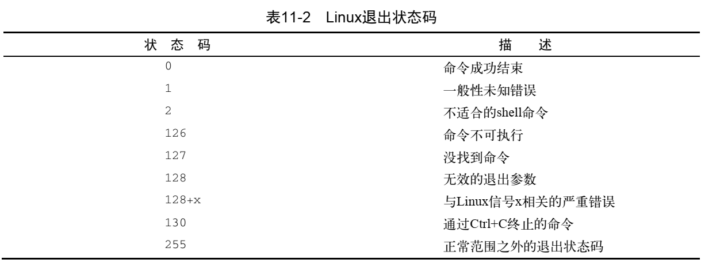
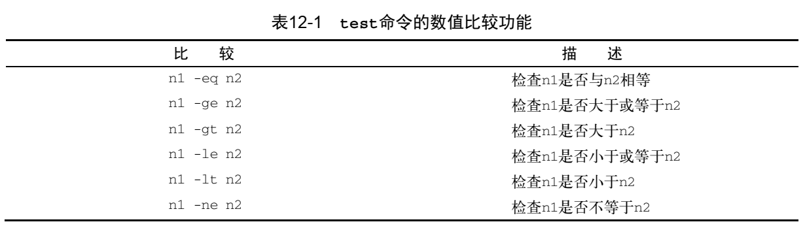
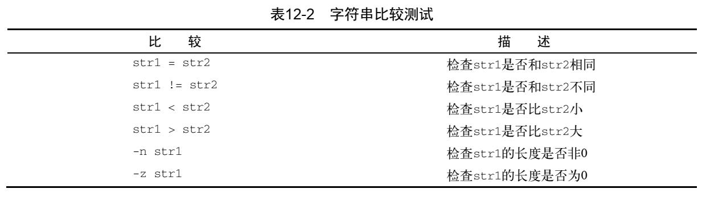
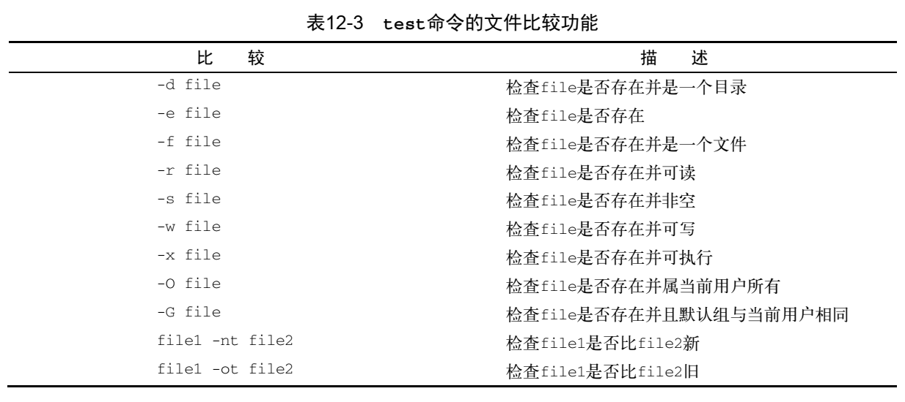
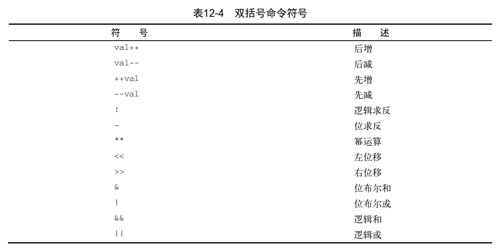

[toc]

# shell
## shell

### 声明 shell

声明指定的shell,  否则就使用默认的shell

ubuntu18.04环境下默认的为/bin/bash。

可以通过命令查看。

```
$ echo $SHELL
```

### 显示消息

```
$ echo "hello world"
```

若需要将接收输入和提示文本输出在同一行，可以使用。

```
$ echo -n "The Time are: "
```

### 使用变量

使用 $ + 变量名 来表示引用某个变量， 变量名也可以用 {} 括起来， 和 cmake 文件中 {} 作用一致。

使用$() 表示执行命令，${} 表示输出变量。

在 echo 输出的字符串中使用 变量时， 需要在 $ 前面加 "\" 转义符。

### 从命令中获取数据

1. 通过 \`shell` 执行命令。
2. $() 格式。

获取日期输出。

```
tesing=$(date)
```

输入重定向，将内容传入 shell 命令.

统计文件的内容。

```
wc < filename
```

### 进行数学运算

1. 使用 expr 命令，不推荐使用。

2. 使用 $[ ] ，推荐使用。

   ```
   var4=$[$var1 * ($var2 - $var3)]
   ```

3. 脚本中使用 bc。

   bc 是 bash 默认的计算器。

   ```
   variable=$(echo "options; expression" | bc)
   ```

   options 是 属性设置， 比如设置 输出的小数为 4位小数， 若有多个属性，使用分号隔开

   ```
   var3=$(echo "scale=4; $var1 / $var2" | bc)
   ```

   扩展:

   *内联输出重定向*

### 查看退出状态码

打印退出状态码，可以使用 $?

```
$ echo $?

```

注意: 不能在命令错误后，在使用其它的命令或函数，比如 echo , 这样 $?的值会被覆盖。

可以使用exit(x) 来选择退出。

```
$ exit 1
```

退出状态码：



### if - then 语句

表示if 后面的命令返回状态为0时， 则执行 then 后面的语句。

有两种写法，推荐使用第一种。

1.

```
if commands
then
	commands
fi
```

2

```
if commands; then
	commands
fi
```

#### if - then - else

```
if commands
then
	commands
else
	commands
fi
```

####  if - then - elif -then

```
if command1
then
	commands
elif command2
then
	more commands
fi
```

### 测试变量并退出

#### test

```
$ test condition
```

若test 后面不接内容， 则会执行false 判断分支的内容。

判断变量是否有值。

```
my_variable="Full"

if test $my_variable
then
	echo "The $my_variable expression returns a True"
else
	echo "The $my_variable expression returns a False"
fi
```

#### if [ condition ]

这种是  test 的缩写

注意：第一个方括号之后和第二个方括号之前必须要有空格

```
if [ condition ]
then
	commands
fi
```

### 变量比较

#### 支持3类数值比较 

* 数值比较  

* 字符串比较

* 文件比较


#### 数值比较

1. eq: equal

2. ge: greater equal

3. gt: greater than

4. le: lower equal

5. lt: lower than

6. ne: not equal



```
if [ $value1 -gt 5 ]
then
	commands
fi
```


注意：

bash shell 只能处理整数， 不能用 test 处理浮点数


#### **字符串比较**

字符串比较字符大小时，是安装字典顺序来排序的，和 map 的原理是一样的。



注意：

字符串比较时，需要对 运算符进行转义。\
最好使用双方括号， 使用单括号时，当前面的变量不存在时，就会变成 `if [ = "push" ]`, 从而报错

```
if [[ $val1 \> $val2 ]]
```

sort 比较字符串大小的顺序和 test 相反， 在 test 中， 大写字符时小于小写字母的， 按照 ASCII 来进行排序的，而 sort 相反。


#### **文件比较**



```
if [ ! -f "/usr/data" ]
then
    echo "file not exsit"
fi
```


### 复合条件测试

- [ ] [ condition1 ] && [ condition2 ]  
- [ ] [ condition1 ] || [ condition2 ]  


### if - then的高级特性

#### 双括号

双括号里面除了 test 命令使用的标准数学运算符，还允许使用高级数学表达式。

```
(( expression ))
```



#### 双方括号

针对字符串比较的高级特性。

```
[[ expression ]]
```

它提供了 test 命令未提供的另一个属性 —— 模式匹配。 

```
if [[ $USER == r* ]]
```

**注意：**

不是所有的shell 都支持双方括号。

### switch - case

shell脚本也可以写分支, 每个分支结束的地方都要添加双分号做区分。

```
case $USER in
#分支1，合并了两个判断。
rich | barbara)
	echo "Welcome, $USER";;
#分支2
testing)
	echo "testing";;
#分支3，表示剩下的分支，即 default
*)
	echo "not allowed";;
esac
```


### for 循环

格式：

```
for var in list
do
	commands
done
```

#### 读取列表中的复杂值

```
for test in Alabama Alaska Arizona Arkansas California Colorado
do
	echo The next state is $test
done
```

注意: 

list 以空格做分隔， 当 出现 单引号 或者双引号时， 需要添加转义符 或者 使用双引号，否则 shell 会尝试使用它们来定义一个单独的数据值。

#### 从变量中读取列表

```
list="Alabama Alaska Arizona Arkansas Colorado"
# 为其拼接一个字符串，也可以屏蔽掉。
list=$list" Connecticut"

for state in $list
do
	echo "Have you ever visited $state?"
done
```

#### 从命令中读值

```
file="states"
for state in $(cat $file)
do
	echo "Visit beautiful $state"
done
```

注意：

当使用这种方式读取文件时，因为是用 list 是用空格做分隔的，所有文件中的空行也会单独被列为一项。

可以在shell脚本中临时更改IFS环境变量的值来限制被bash shell 当做字段分隔符的字符 。

默认的字段分隔符有：

- [ ] 空格 (0x20)
- [ ] 制表符
- [ ] 换行符(用于换行时垂直方向的对齐，0x10)

使用换行符作为分隔符号

```
IFS=$'\n' 
```

当代码量较大的时候，可能只需要在一个地方修改 IFS 的 值， 然后忽略这次修改，其它地方使用IFS的默认值

```
IFS.OLD=$IFS
IFS=$'\n'
<在代码中使用新的IFS值>
IFS=$IFS.OLD
```

若要使用多个分隔符，则将它们串起来

```
IFS=$'\n':;"
```

#### 使用通配符读取目录

```
for file in /home/rich/test/*
```

#### C 语言风格的 for 循环

```
for (( variable assignment ; condition ; iteration process ))
```

例:

```
for (( a = 1; a < 10; a++ ))
```

这种格式的 for 命令部分可以不遵守bash shell 的 for 命令

- [ ] 变量赋值可以有空格
- [ ] 条件中的不以美元符开头
- [ ] 迭代过程中的算式未用expr 命令格式。


### while 循环

格式：

```
while test command
do
	other commands
done
```

当 command 退出状态码一直正确时， 会一直死循环。

例:

```
while [ $var1 -gt 0 ]
do
	echo $var1
	var1=$[ $var1 - 1 ]
done
```

### until 循环

和 while 循环相反，只有当该命令正确执行后才会退出循环。

```
until test commands
do
	other commands
done
```

### break 和 continue

continue 和 C 语言中含义一样，结束本次剩下的循环，开启下一次循环。

break 可以跳出多层循环。

```
break n
```

continue 也可以指定执行哪一级循环

```
continue n
```

### 处理循环的输出

在 done 后面使用 重定向 符号， 则将输出打印到文件中。

是将每次循环的数据都存在一起， 在 执行完毕后存入文件中。

```
for (( a = 1; a < 10; a++ ))
do
	echo "The number is $a"
done > test23.txt
#done | sort
```

### 获取长度 与 大小

1.shell数组的长度

${#array[@]}

${#array[*]}

2.shell数组的所有成员

${array[*]}

3.字符串的长度

${#str}