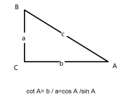

## 三角函数

弦表示对斜边，正表示锐角的对边，余表示邻边（非斜边），切，表示垂直于该线，割表示不包含此线的另两条线做比较，且斜边为分子。

#### 正弦

> 对边与斜边相除，即sinA = a/c。
>
> 

#### 余弦

> 邻边和斜边相除，即 cosA = b /c.

#### 余切

> 邻边和对边相除，cotA = b/a,与正切互为倒数。
>
> 

#### 余割

> 斜边和对边的比较，与正弦互为倒数，即cscA = c/a 。

#### 正割

> 斜边与邻边的比较，与余弦互为倒数，secA = c/b。

#### 反三角函数

> 求角度，即根据三角函数求角度。

