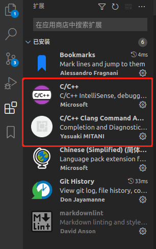

# VSCode

## 添加头文件路径

1. F1 打开命令行。
2. 选择C/C++:Edit Configuration(JSON)， 将生成 c_cpp_properties.json 配置文件。
3. 编辑配置文件的 includePath选项。

## 更改 vscode 代码风格
1. 下载插件，分别为了阅读`cpp`代码和格式化

    
2. 备份原有的格式文件(若是命令执行失败说文件没有生成，并不影响后面的操作)

    xxx为用户名
    ```
    $ cp /home/xxx/.config/Code/User/settings.json /home/xxx/.config/Code/User/settings.json.bak
    ```
3. 将下述内容写入`/home/xxx/.config/Code/User/settings.json`文件中
    ```
    {
    "editor.fontSize": 12,
    "terminal.integrated.fontSize": 12,
    // 调整 cpp 格式
    "C_Cpp.clang_format_fallbackStyle": "{ BasedOnStyle: Google, UseTab: Never, IndentWidth: 4, TabWidth: 4, BreakBeforeBraces: Linux, AllowShortIfStatementsOnASingleLine: true, IndentCaseLabels: false, ColumnLimit: 120}",
    // 调整字体
    "editor.fontFamily": "'monospace', monospace, 'Droid Sans Fallback'",
    // 调整tab空格大小
    "editor.tabSize": 4,
    // 使 tab 的更改生效
    "editor.detectIndentation":false
    }
    ```
4. 重启scode
